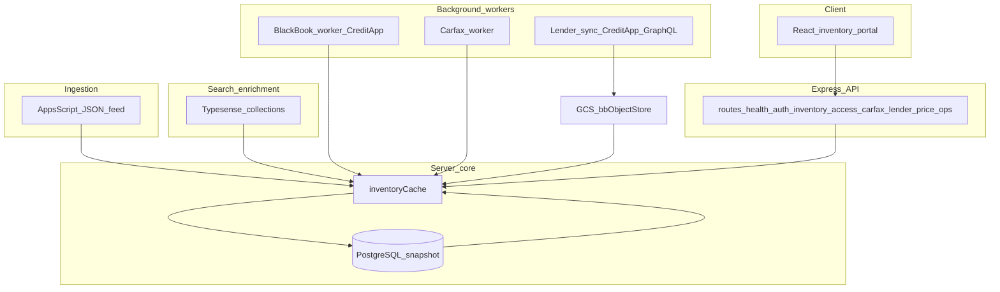
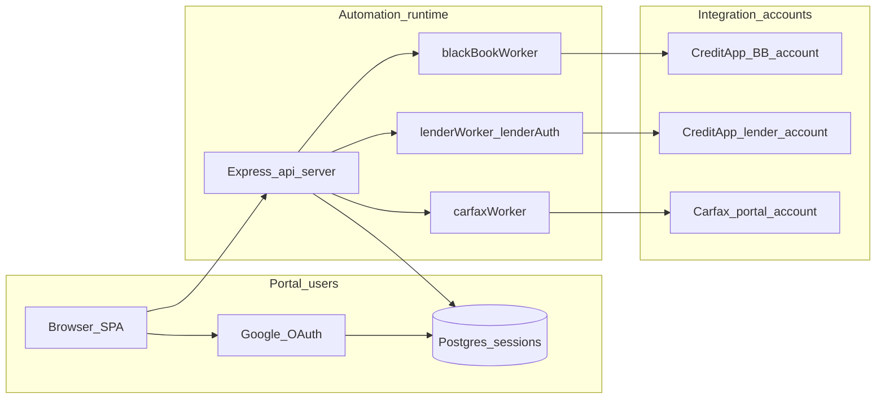

# Inventory Platform — Functionality and how it is achieved

**Audience:** Engineers and operators onboarding to this repository, or readers of the machine-generated source bundle (`downloads/inventory-platform-complete-source-part-01-of-10.md` through `part-10-of-10.md`).

**What this is:** A narrative companion to that bundle. It explains what the platform does for a dealership, which systems it touches, and the main engineering choices that make the behavior reliable. It does not reproduce large slabs of embedded source from the export.

**What this is not:** Operational guidance for compromising third-party accounts, or generic instructions to defeat multi-factor authentication. Where CreditApp or Carfax automation appears below, it is described as **authorized service-account automation** using credentials and TOTP or backup codes the dealer controls, stored in environment secrets.

---

## 1. Business purpose and everyday use

The Inventory Platform is a **private** web application for vehicle dealership operations. It answers a small set of recurring questions:

- What vehicles are we advertising right now, with photos and structured fields suitable for staff (not only for a public website)?
- Which rows still need enrichment (Canadian Black Book wholesale guidance, Carfax Vehicle History Report links, live listing URLs and prices from search indexes)?
- Who on the team may see which columns (for example wholesale-oriented columns that should not appear to every guest user)?
- For the finance desk, given a lender’s published program matrix from the dealer’s lender portal, what payment, exposure, and product stacks are plausible for a particular vehicle and approval assumptions?

The user interface is a **React single-page application** in `artifacts/inventory-portal/`. It talks to an **Express 5 API** under `artifacts/api-server/src/`. Data originates in a **Google Sheets–backed Apps Script pipeline**, is normalized on the server, enriched from external services, persisted in **PostgreSQL**, and cached in memory for low-latency reads.

That split—**human auth at the portal** versus **machine auth to vendor portals**—is one of the defining architectural stories of the system and is revisited in Section 9 with a diagram.

---

## 2. High-level system architecture

At the center is `artifacts/api-server/src/lib/inventoryCache.ts`. It holds the working copy of inventory the API serves, coordinates refresh from the Apps Script feed, merges Black Book and Carfax artifacts, and calls into `lib/typesense.ts` for dealer-specific search collections that carry live listing URLs, prices, and image lists.

Around that core sit three long-running integration styles:

1. **Headless browser workers** for vendors where a stable public API is not what the product depends on (Canadian Black Book through CreditApp; Carfax Canada through the dealer portal), implemented with Puppeteer-style automation.
2. **GraphQL ingestion** for lender program matrices from CreditApp, via `lib/lenderAuth.ts` and `lib/lenderWorker.ts`, cached to Google Cloud Storage–backed object storage through `lib/bbObjectStore.ts`.
3. **Search HTTP** to Typesense for structured documents keyed per dealer collection, with API keys provided as environment secrets.

The following diagram matches the canonical picture in `AGENTS.md` and is the backbone of the data plane narrative.

---

## 3. Monorepo layout and why it matters

The repository is a **pnpm workspace** (`pnpm-workspace.yaml`, root `package.json`). TypeScript is configured with **composite projects** and `projectReferences` so cross-package imports typecheck from the root (`pnpm run typecheck`). That choice pays off because generated code (`lib/api-client-react`, `lib/api-zod`) must stay aligned with hand-written routes.

Major roots (see `replit.md` and `AGENTS.md`):

- `artifacts/api-server` — deployable API (`@workspace/api-server`).
- `artifacts/inventory-portal` — Vite-built SPA (`@workspace/inventory-portal`).
- `artifacts/mockup-sandbox` — **non-production** UI experiments.
- `lib/db` — Drizzle schemas and database access (`@workspace/db`).
- `lib/api-spec` — `openapi.yaml` plus Orval configuration.
- `lib/api-zod` and `lib/api-client-react` — generated artifacts consumed by server and portal.
- `scripts` — golden tests, scenario tests, smoke utilities, pattern checks, markdown export.
- `docs` — pattern catalog, stability notes, ADR-style documents embedded in the complete-source export.
- `attached_assets` — captured reference payloads and the `InventorySync_v3.2.gs` Apps Script source (not executed from that path in production).
- `downloads` — markdown snapshots including the ten-part complete source split.

This layout makes it obvious **where a change must ripple**: API shape changes start in `lib/api-spec/openapi.yaml`, then codegen, then route handlers, then portal hooks.

---

## 4. Inventory ingestion: from spreadsheet culture to an API-shaped cache

### 4.1 Apps Script and the webhook contract

Dealership inventory often lives in Google Sheets before it lives in a polished dealer website CMS. The platform embraces that reality.

The Apps Script project (reference copy in `attached_assets/InventorySync_v3.2.gs`) exposes a **Web App** URL. The server reads full inventory JSON from `INVENTORY_DATA_URL` (secret), which is the web app URL with `?action=inventory`. A separate `APPS_SCRIPT_WEB_APP_URL` (no query string) supports other callbacks documented in `replit.md`.

When inventory changes on a schedule or operator action, Apps Script can call back into the Replit-hosted API using `REFRESH_SECRET` as an authentication header for `POST /refresh` (webhook-style refresh). That design lets the sheet remain the **editorial surface** while the Node process becomes the **serving and enrichment surface**.

### 4.2 Dual-layer cache: memory plus database snapshot

`inventoryCache.ts` maintains an in-memory structure for fast `GET /inventory` responses. PostgreSQL table `inventory_cache` stores a singleton row (`id = 1`) with the serialized JSON snapshot and `last_updated`. That persistence survives process restarts and gives operators a concrete “as of” timestamp for support.

Hourly refresh behavior is described in `replit.md`: the cache auto-refreshes on a timer, and the portal polls `GET /cache-status` every 60 seconds so the UI can quietly refetch when the server moves forward.

### 4.3 New-unit detection and targeted enrichment

Rather than blindly re-querying Black Book and Carfax for the entire fleet on every minor edit, the platform compares the incoming feed to the previous cache snapshot. **New VINs** trigger targeted lookups for Black Book and Carfax only for those units. That is both a cost control and a latency control: the expensive integrations scale with *delta*, not *N* on every tick.

Carfax behavior (also in `replit.md`) skips VINs that already have an `http` URL but will re-attempt rows explicitly marked `NOT FOUND`, so stale negatives do not freeze the dataset forever.

### 4.4 One-sheet architecture and archive semantics

`replit.md` documents a **one-sheet architecture**: Apps Script serves filtered inventory (column H filled means “Your Cost” is present) via `?action=inventory` without maintaining a separate “SharedInventory” sheet.

Vehicles removed from the Matrix feed are moved to an **Archive** tab rather than silently deleted from operational memory, preserving a paper trail aligned with how dealers reason about stock that left the active pipeline.

---

## 5. Typesense: live market signals layered on static feed rows

`lib/typesense.ts` centralizes host configuration, per-dealer collection metadata (`DEALER_COLLECTIONS`), and helper routines such as `typesenseSearch` and `extractWebsiteUrl`. Secrets such as `TYPESENSE_KEY_PARKDALE` and `TYPESENSE_KEY_MATRIX` are scoped search keys—**not** admin keys checked into source.

During merge in `inventoryCache.ts`, the server queries Typesense for documents matching VINs and blends in fields like image URLs, listing URLs, and price signals. That means the spreadsheet feed does not need to be the canonical source for every commercial field the staff cares about; Typesense carries the **live website projection** of the same VINs.

`routes/price-lookup.ts` exposes `GET /price-lookup?url=` which resolves a public listing URL back to a live price via Typesense. That route is intentionally documented in `AGENTS.md` as using `req.isAuthenticated()` rather than the standard `requireAccess` helper, with an inline rationale—one of several **documented exceptions** to global patterns.

Documentation in the export’s `docs/` region (visible toward the end of `inventory-platform-complete-source-part-10-of-10.md`) discusses scoped keys and why the frontend cannot escape its dataset by tampering with query parameters when keys are generated with embedded filters.

Vehicle photos are served from the CDN base documented in `replit.md` (`https://zopsoftware-asset.b-cdn.net`) combined with semicolon-delimited paths from Typesense `image_urls`, so imagery stays decoupled from binary blobs in Postgres.

---

## 6. Canadian Black Book via CreditApp browser automation

Canadian Black Book wholesale values are obtained through **CreditApp’s administrative web experience**, not through a first-class public REST contract owned by this repository. The implementation lives in `lib/blackBookWorker.ts`.

### 6.1 Login, cookies, and cross-environment continuity

The worker signs in with `CREDITAPP_EMAIL` and `CREDITAPP_PASSWORD`. Session material is persisted so that production does not necessarily need to open a browser on every cold start: cookies and state flow through **object storage keys** such as `bb-session.json` and companion DB row `bb_session` (singleton), with a tiered fallback pattern described in `replit.md` (object storage first, then database, then local file, then browser login in development contexts).

Because Replit provisions **separate Postgres instances** for development and production but **shares** the GCS-backed object storage bucket, developers can perform an interactive login in a dev environment and still have production consumers read merged BB value maps—**with explicit merge semantics** so partial dev runs do not wipe production maps (`saveBbValuesToStore` merge-not-replace behavior per `replit.md`).

### 6.2 Multi-factor authentication as a state machine, not a special case

CreditApp’s MFA surfaces as a sequence of URLs and DOM states (`mfa-otp-challenge`, SMS enrollment routes, OTP enrollment, login option pickers). The worker detects those screens from URL fragments and visible copy, then:

- Generates a time-based one-time password from `CREDITAPP_TOTP_SECRET` when that secret is configured, **or**
- Uses a TOTP secret extracted during an automated enrollment capture path when the deployment is walking the enrollment UX legitimately for the dealer-owned account.

This is best understood as **implementing the vendor’s MFA UX for an account that already has TOTP enabled or is being enrolled with automation assistance**, not as circumventing MFA in the abstract. The lender CreditApp identity uses backup-code automation instead (see Section 8).

### 6.3 Valuation quality: trim matching and NHTSA decode cache

When CreditApp’s CBB endpoint returns multiple trims, the worker scores candidates using vehicle description tokens, CBB series and style fields, and a **cached NHTSA VIN decode** (`decodeVinNhtsa` cached in-memory for the process lifetime). If nothing confidently matches, the worker uses the **median** wholesale among trims rather than the lowest—a deliberate bias against silently picking an unrealistically cheap tail outcome.

All candidate trims and scores are logged for later human audit. That observability is part of the product’s safety posture when automation chooses among ambiguous vendor data.

### 6.4 Daily Black Book rhythm

Black Book runs once per day at a randomized time inside Mountain business hours. Development runs are expected to refresh cookies and valuation maps into object storage; production loads those artifacts during hourly inventory refresh via `loadBbValuesFromStore()` so the hot path stays read-heavy.

---

## 7. Carfax Canada via dealer portal automation

`lib/carfaxWorker.ts` automates the Carfax Canada dealer portal using credentials `CARFAX_EMAIL` and `CARFAX_PASSWORD`, gated by `CARFAX_ENABLED`. Production policy (`isProduction` from `lib/env.ts`) can disable the worker even when secrets exist, reflecting the operational note in `AGENTS.md` that `isProduction` controls Carfax worker disable among other behaviors (secure cookies, log format, session secret enforcement).

Results are written back through Apps Script `doPost` flows (see `replit.md` “Carfax cloud worker”), keeping the sheet and the server cache aligned with what staff already trust as a notification channel.

The Carfax domain is another example where **headless browsing** is the integration surface because the business requirement is “staff sees a working VHR link column,” not “we operate a public Carfax API client.”

---

## 8. Lender programs and the deal calculator

### 8.1 GraphQL sync versus browser automation

Lender program matrices—tiers, term matrices, condition matrices, program-level caps—are fetched over **CreditApp GraphQL** inside `lenderWorker.ts`, authenticated through `lenderAuth.ts`. That path is intentionally **separate** from the Black Book worker identity: different secrets (`LENDER_CREDITAPP_*` vs `CREDITAPP_*`), separate `lender_session` table, and separate object storage keys such as `lender-programs.json`.

Separation reduces coupling: a BB session refresh does not invalidate lender GraphQL cookies, and blast radius for credential rotation is smaller.

### 8.2 Two-factor handling for the lender identity

`replit.md` documents that lender 2FA is satisfied by automatically entering a **backup code** (`LENDER_CREDITAPP_2FA_CODE`) when required, rather than attempting to dismiss the prompt. TOTP secret `LENDER_CREDITAPP_TOTP_SECRET` is also available for the TOTP-style path. These are standard factors for accounts that support backup codes and TOTP—again, for **dealer-owned** CreditApp credentials.

### 8.3 Program shape and retailer identity

Cached programs include multiple creditors (for example Santander, Eden Park, ACC, iAF, Quantifi, Rifco, in-house) normalized into a uniform structure inside `lenderWorker.ts` with mapping tables such as `CREDITOR_NAME_TO_CODE` (see `artifacts/api-server/src/lib/README.md`).

`replit.md` spells out LTV chains, aftermarket bases, auto-optimization respecting warranty and GAP caps, and the retailer UUID used when querying CreditApp—details that matter when reconciling calculator output against the lender portal UI.

### 8.4 Pure finance math outside HTTP handlers

All cap logic, no-online selling price behavior, and stacking constraints live in `lib/lenderCalcEngine.ts`. Route code in `routes/lender/lender-calculate.ts` validates requests with Zod (often generated shapes from `@workspace/api-zod`), loads cached programs, calls the engine, and returns JSON.

This separation exists so `scripts/src/lender-engine.golden.test.ts` and `scripts/src/lender-calc-scenarios.test.ts` can lock behavior for representative lenders (ACC, SAN, iAF, QLI fixtures) without standing up Express.

`lib/runtimeFingerprint.ts` adds calculator version and git SHA metadata to responses so operators can prove which build answered a support ticket.

---

## 9. Portal authentication, roles, and centralized field filtering

### 9.1 Google OAuth and PostgreSQL sessions

Humans authenticate with **Google OAuth** via Passport configuration in `lib/auth.ts`. Sessions are stored in PostgreSQL using `connect-pg-simple` (`session` table), which makes horizontal scaling and session revocation straightforward.

`OWNER_EMAIL` (secret) marks the single owner account. Other users appear in `access_list` with roles `viewer` or `guest`. Middleware helpers gate routes:

- `requireOwner` for destructive or costly operations (Black Book refresh, lender admin, access mutations).
- `requireAccess` for any user on the access list (inventory read, calculator read paths, ops status for authenticated staff).
- `requireOwnerOrViewer` where guests must be excluded; this middleware also sets `req._role` so handlers avoid an extra database hit.

### 9.2 Server-side enforcement beats UI-only hiding

`lib/roleFilter.ts` implements `filterInventoryByRole`. Inventory routes apply it so guests never receive wholesale columns in JSON, not merely hidden in CSS. That design choice is called out explicitly in `replit.md` as a security posture decision.

When an owner deletes a user, `routes/access.ts` purges their rows from the `session` table so revocation is **immediate**, not “when the JWT expires.”

### 9.3 Human auth versus integration auth (second diagram)

---

## 10. Express API surface (route-by-route intent)

The mount order in `artifacts/api-server/src/app.ts` and `routes/index.ts` is load-bearing for middleware assumptions (CORS, sessions, rate limiting at 60 requests per minute per IP on `/api` except `GET /healthz`, trust proxy, and so on—see `replit.md`).

Key routes (paths relative to `artifacts/api-server/src/routes/`):

- `health.ts` — `GET /healthz` liveness.
- `auth.ts` — Google login, callback, logout, `GET /me` identity for the SPA; optional dev-only callback debug route per `replit.md`.
- `inventory.ts` — primary inventory read, cache introspection, webhook refresh, owner-only Black Book refresh, vehicle images.
- `access.ts` — CRUD on `access_list` plus `GET /audit-log` for owner accountability.
- `carfax.ts` — batch status and manual batch/test triggers for Carfax processing.
- `lender/index.ts` — barrel mounting read, calculate, and admin lender routes.
- `price-lookup.ts` — authenticated URL-to-price resolution via Typesense.
- `ops.ts` — `GET /ops/function-status` for explicit pass/fail operational signals; owner-only diagnostics and deep health where implemented.

Each new route is expected to use `validateBody` / `validateQuery` / `validateParams` from `lib/validate.ts` rather than ad-hoc parsing, and to take configuration from `lib/env.ts` rather than raw `process.env` reads—those conventions are **CI enforced** (Section 18).

---

## 11. Operational transparency: function status, self-heal, and incidents

`routes/ops.ts` implements `GET /ops/function-status` (authenticated with `requireAccess`). It aggregates:

- Inventory row counts and simple coverage metrics for Black Book recency and success versus failure states.
- Carfax URL versus `NOT FOUND` tallies as a proxy for coverage and continued attempts.
- Website URL coverage similarly (Typesense-driven fields on rows).
- Lender program cache presence and freshness.
- Persisted session rows for BB, lender, and Carfax singletons.
- Self-heal feature flags (`SELF_HEAL_*` family in `env.ts`) and optional GCS-backed toggles via `bbObjectStore` helpers such as `loadSelfHealAutomergeToggle`.

That endpoint is the human-friendly answer to “is the machinery healthy right now?” without shell access.

Related libraries such as `lib/incidentService.ts` support incident recording and listing for operational forensics (imported from the ops router). The complete-source export’s section **11b** collects additional ops, incident, and self-heal documentation—worth reading when changing behavior in this area.

---

## 12. Randomized scheduling within Mountain Time business hours

All three heavy workers register through `lib/randomScheduler.ts`, which picks a **random minute** inside a window expressed in **America/Edmonton** Mountain Time: weekdays 08:30–19:00, weekends 10:00–16:00.

That is a deliberate product decision: it avoids thundering herds at process start, spreads vendor load, and mirrors human dealership hours so overnight runs do not fight against staff who might still be logged into the same vendor sessions interactively.

---

## 13. OpenAPI, Orval, and generated clients

`lib/api-spec/openapi.yaml` is the contract. Running `pnpm --filter @workspace/api-spec run codegen` (workspace conventions also mention `pnpm codegen` from `AGENTS.md` common changes table) regenerates:

- `lib/api-zod` — Zod models used for validation and typing on the boundary.
- `lib/api-client-react` — React Query hooks and fetch wrappers for the portal.

This pipeline is the main reason the SPA and the server rarely disagree about field names or enum shapes: they share a generated vocabulary.

---

## 14. Frontend portal pages and behaviors

The production SPA (`artifacts/inventory-portal`) implements:

- `/login` — Google sign-in entry.
- `/` — inventory table on desktop, responsive card layout under 768px width, photo gallery with keyboard navigation, VIN copy-to-clipboard, role-aware pricing columns.
- `/admin` — owner-only access management and audit log tab.
- `/calculator` — owner-only lender deal calculator experience tied to cached programs and inventory affordability filtering.
- `/denied` — explicit access denied UX.

The portal uses generated hooks for most API traffic. A few intentional raw `fetch` calls remain for specific endpoints, each documented inline per `AGENTS.md` “Verified Intentional Deviations” (for example `/api/refresh-blackbook` and `/api/ops/function-status`).

---

## 15. Mockup sandbox versus production portal

`artifacts/mockup-sandbox/` is a standalone Vite app for experimenting with UI components without coupling to production routing, auth, or deployment. It is explicitly called out in `AGENTS.md` as **not** the production portal. Treat it as a sketchpad that may lag API reality.

---

## 16. Email invitations and audit logging

`lib/emailService.ts` integrates Resend (`RESEND_API_KEY`, optional) for invitation emails when owners add emails to the access list.

`audit_log` captures role transitions with actor identity, giving a defensible trail when a guest becomes a viewer or access is revoked—important for small teams where administrative power is concentrated in the owner account.

---

## 17. Database tables and responsibilities

Per `AGENTS.md` and `replit.md`:

- `session` — connect-pg-simple session storage for browser users.
- `access_list` — email, role (`viewer` or `guest`), metadata for invitations.
- `audit_log` — append-only administrative actions.
- `inventory_cache` — singleton JSON snapshot of merged inventory.
- `bb_session` — singleton persistence for Black Book worker cookies and timestamps.
- `lender_session` — singleton persistence for lender sync cookies and timestamps.

Schema source files live under `lib/db/src/schema/` with README guidance for migrations and `drizzle.config.ts` expectations (`DATABASE_URL` on Replit).

---

## 18. Testing and offline correctness machinery

Beyond TypeScript typechecking (`pnpm run typecheck` and CI’s `typecheck:libs` plus api-server typecheck), the repo invests in **domain tests** that do not require live vendor sessions:

- `scripts/src/lender-engine.golden.test.ts` — golden expectations for cap profile resolution and no-online selling price logic.
- `scripts/src/lender-golden-fixtures.ts` — shared fixture data for multiple lenders.
- `scripts/src/lender-calc-scenarios.test.ts` — multi-scenario calculator coverage (stacking, LTV edges).
- `scripts/src/lender-smoke.ts` — optional live API smoke path for deployed environments.

CI also runs `test:self-heal-primitives` and `test:chaos-primitives` (chaos job is `continue-on-error: true` in `.github/workflows/ci.yml`), reflecting an engineering culture that accepts flaky externalities while still testing deterministic primitives.

---

## 19. CI gates: patterns, invariants, and README sync

The `check` job in `.github/workflows/ci.yml` runs, in order: install, library typecheck, api-server typecheck, lender golden tests, lender scenario tests, self-heal primitive tests, `check:patterns`, `check:readme-sync`, and `check:invariants`.

`scripts/src/check-patterns.ts` encodes many of the rules duplicated for human authors in `.cursorrules` and `AGENTS.md` “Anti-Patterns.” That duplication is intentional: **robots enforce what documents teach**, reducing stylistic drift that often hides real bugs (for example, reading `process.env` directly and bypassing Zod validation in `env.ts`).

The separate `self-heal-gate.yml` workflow (see `.github/workflows/`) signals that autonomous repair paths are guarded by explicit CI policy rather than only runtime toggles.

---

## 20. Documentation corpus: patterns, SLAs, stability, and honest gaps

`docs/patterns.md` is the pattern catalog with copy-pastable examples for env access, auth middleware selection, Zod validation, Typesense searches, role filtering, logging, random scheduling, GCS usage, and Express async handler style.

Other embedded documents (visible toward the end of part 10 of the complete-source export) include ADR-style decision logs, operational SLAs, enterprise stability gap analysis (`docs/enterprise-stability-gaps.md` in the export), and enterprise key scoping notes. Together they record not only **what to do** but **what we are not pretending to solve yet** (for example multi-region active-active on the current Replit hosting model).

That honesty is itself an architectural stance: the runtime includes self-healing and rollback concepts, but the documentation admits deployment limits.

---

## 21. Security and configuration surface (condensed)

- Secrets live in Replit Secrets or equivalent secret managers, never in git.
- `SESSION_SECRET` is mandatory in production deployments (`REPLIT_DEPLOYMENT=1`) and tied to `isProduction` behavior.
- Typesense keys are per-collection scoped search keys.
- CreditApp and Carfax credentials are integration secrets with separate identities per integration.
- Rate limiting applies broadly across `/api` to reduce accidental or abusive load.

---

## 22. Machine-generated complete source export as a meta-artifact

Running `pnpm --filter @workspace/scripts export:complete-md` emits `downloads/inventory-platform-complete-source.md`, a single markdown file ordered by **business domain** rather than alphabetical path. The ten-part split exists purely for size-friendly viewing; fences are never cut mid-file.

That export is interesting in its own right: it is a **reproducible archive** of the system’s human and generated code, suitable for legal discovery, onboarding reading assignments, or attaching to AI tools—without hand-maintaining a second documentation tree that would inevitably drift.

---

## 23. Appendix — quick file-to-concept index

Each line names a file under `artifacts/api-server/src/lib/` unless noted, and states a single responsibility in one sentence.

- `auth.ts` — Passport Google strategy and shared route gating middleware.
- `inventoryCache.ts` — In-memory inventory, DB snapshot coordination, merge pipeline.
- `roleFilter.ts` — Serialize inventory differently per `UserRole`.
- `lenderCalcEngine.ts` — Pure lender math used by HTTP routes and offline tests.
- `lenderWorker.ts` — GraphQL sync, normalization, GCS program cache writes.
- `lenderAuth.ts` — CreditApp lender session cookies and GraphQL client bootstrap.
- `blackBookWorker.ts` — CreditApp browser automation for CBB wholesale retrieval.
- `carfaxWorker.ts` — Carfax portal automation and batch orchestration.
- `bbObjectStore.ts` — GCS JSON blobs for sessions, BB maps, lender programs, toggles.
- `emailService.ts` — Resend invitation sender.
- `logger.ts` — Pino structured logging facade.
- `randomScheduler.ts` — Mountain Time business-hours randomized cron windows.
- `typesense.ts` — Dealer collection registry and HTTP search helper.
- `env.ts` — Zod-validated configuration and `isProduction` derivation.
- `validate.ts` — Express middleware factories for Zod parsing.
- `runtimeFingerprint.ts` — Build metadata for lender calculator responses.
- `incidentService.ts` — Ops incident persistence and listing helpers.
- `routes/health.ts` — Shallow uptime endpoint plus deep health helpers consumed by ops.
- `routes/ops.ts` — Operational dashboards and toggles for advanced maintenance.

---

## 23a. Deeper look at `/ops/function-status` checks

The JSON body returned by `GET /ops/function-status` (see `artifacts/api-server/src/routes/ops.ts`) is structured for dashboards rather than human prose. Understanding its fields explains how operators reason about partial failures.

The top level includes `inventoryCount` and a `selfHeal` object summarizing boolean flags: `SELF_HEAL_ENABLED`, `SELF_HEAL_DRY_RUN`, `SELF_HEAL_AUTOMERGE_ENABLED`, plus `automergeEnabledGcs` hydrated from object storage when available, and `SELF_HEAL_GATE_ACTIVE`. Those flags form a safety ladder—automation exists, but can be constrained to dry-run, gated in CI, or split between env and GCS toggles so runtime changes do not always require redeploys.

Under `checks`, named bundles summarize orthogonal concerns:

- `blackBookUpdatedWithin24Hours` aggregates configuration presence, recency of the last BB worker success, running state, missing environment variable diagnostics, optional production browser login allowances, numeric coverage of valued inventory versus total rows, last outcome, structured error messaging, batch identifiers, and a pending target VIN count for scoped runs.
- `carfaxLookupActivity` treats nonzero attempted lookups as a pass, splitting found URLs from explicit `NOT FOUND` markers so operators can distinguish “no attempts yet” from “attempted but nothing resolvable.”
- `websiteLinkDiscovery` parallels that idea for website links derived from Typesense merges, including a computed coverage percentage across the fleet.
- `lenderProgramsLoaded` asserts that the cached program document exists with at least one program, exposes `updatedAt` freshness, running state from the worker, and GraphQL or persistence errors when present.

A fifth check, `oauthConfiguration`, verifies Google client ID and secret presence and infers callback viability from `REPLIT_DOMAINS` or development mode. That is a deliberate acknowledgment that many integration failures are ultimately OAuth misconfiguration, not downstream finance logic.

The `subsystems` array mirrors database singleton rows for Black Book, lender, and Carfax, exposing `lastOutcome`, `lastErrorReason`, ISO timestamps, consecutive failure counters, and whether recovery is currently running. That symmetry lets humans correlate “what the worker thinks” with “what Postgres last persisted.”

---

## 23b. Additional owner-only operational routes

Beyond function status, `ops.ts` exposes endpoints intended for maintenance UIs or emergency runbooks:

- `GET /ops/incidents` lists stored incidents with optional inclusion of transient rows, pagination parameters, and `Cache-Control: no-store` because the data can include recent operational noise.
- `GET /ops/dependencies` triggers `runDeepHealth()`, returning deep subsystem dependency diagnostics—useful when TLS, DNS, or upstream vendor endpoints fail in ways a shallow `/healthz` cannot surface.
- `POST /ops/self-heal-toggle` persists automerge preference through `saveSelfHealAutomergeToggle` in `bbObjectStore.ts`, enabling operators to flip automation without redeploy when policy allows.
- `GET /ops/dead-letters` surfaces queued actions that failed and require operator triage, including archived versus active rows.

These routes sit behind `requireOwner` because they expose internal maintenance data and can change recovery behavior.

---

## 23c. Dead-letter queue semantics (high level)

The ops router imports `deadLetterQueueTable` from `@workspace/db`. Failed automation actions can enqueue rows instead of silently discarding errors. Owner-only listing keeps those messages away from guest dashboards while still giving the dealership a **paper trail** when headless workers hit vendor UI changes or transient network partitions.

When reading dead letters operationally, treat spikes after vendor deploy weeks as signals to refresh DOM selectors or MFA flows in the worker implementations, not as signals to disable enrichment permanently.

---

## 24. Anti-patterns as positive architecture (what CI enforces)

`AGENTS.md` lists “Anti-Patterns (DO NOT)” that double as a concise architecture manifest. They are worth repeating here because they explain *negative space*—decisions the team refused because they caused bugs in similar systems.

- Centralize auth gates in `lib/auth.ts` instead of re-implementing `if (!req.user.isOwner)` blocks per route, so audits of security posture require reading one module.
- Centralize Typesense configuration in `lib/typesense.ts` instead of scattering hosts or collection IDs, so key rotation touches one file.
- Centralize environment reads in `lib/env.ts` so mis-set variables fail fast at process boot with Zod errors rather than mid-request `undefined` surprises.
- Centralize request parsing in `validate.ts` middleware so validated payloads always land in typed fields like `req.validatedQuery` rather than ad-hoc `String(req.query.foo ?? "")` chains.
- Forbid `(req as any)` casts; extend `Express.Request` in `types/passport.d.ts` so custom properties remain discoverable in IDE tooling.
- Forbid CommonJS `require()` except documented dynamic import escapes, keeping the graph statically analyzable for bundlers and security scanners.
- Forbid inline wholesale field deletion in routes; always call `filterInventoryByRole` so guest-safe serialization cannot drift between endpoints.
- Forbid pure finance math inside route files; keep `lenderCalcEngine.ts` as the single numerical authority.

`scripts/src/check-patterns.ts` encodes many of these prohibitions mechanically, which is how the repository scales contributor count without scaling review meetings linearly.

---

## 25. Express 5 and async handler discipline

The API server runs on **Express 5** (`replit.md`). Express 5’s error-handling expectations differ subtly from older callback-heavy styles. `docs/patterns.md` documents the canonical async handler pattern used across routes so rejected promises surface to Express error middleware instead of hanging requests.

That matters because almost every route touches asynchronous I/O: Postgres, GCS, Typesense HTTP, Puppeteer, or GraphQL. A single unhandled rejection in a hot path would otherwise become a socket leak under load.

---

## 26. Structured logging and observability defaults

`lib/logger.ts` wraps Pino. Structured logs mean workers can emit machine-parseable events (`secretLen`, `method`, `url`, `subsystem`) without inventing a bespoke logging stack per integration.

In production, `isProduction` switches log formatting (JSON versus pretty) per `AGENTS.md`, aligning with hosted log collectors on Replit deployments while keeping developer ergonomics locally.

---

## 27. Lender routes split across three files for clarity

`routes/lender/index.ts` is only a barrel, but the split between `lender-read.ts`, `lender-calculate.ts`, and `lender-admin.ts` encodes **separate threat models**:

- Read routes must be safe for frequent polling by the SPA when showing program metadata.
- Calculate routes accept structured finance inputs and must validate aggressively.
- Admin routes trigger expensive sync operations and therefore demand owner authentication.

Keeping those concerns in separate files reduces accidental middleware misapplication when adding endpoints.

---

## 28. Inventory routes: owner-only Black Book refresh

`POST /refresh-blackbook` is owner-gated because it launches CreditApp browser work that can be slow and can trip vendor rate limits if abused. The portal uses raw `fetch` for this endpoint per intentional deviation documentation—generated hooks are not always the right tool when an endpoint is rarely called, highly privileged, and needs bespoke error surfacing.

---

## 29. Carfax routes: batch orchestration versus tests

`routes/carfax.ts` exposes batch status for transparency, a manual batch runner for catch-up days, and a test entry point for validating automation changes in staging-like environments. Those controls exist because Carfax automation is inherently more fragile than REST CRUD: selectors depend on vendor HTML.

---

## 30. Access routes: invitations and auditability

`routes/access.ts` is the administrative heart of multi-user dealerships. Owners can list emails, change roles, delete users, and read `audit_log`. The combination of **email invitations** (optional Resend integration) and **immediate session purge** on delete closes common SMB security gaps where former employees retain hours of valid session.

---

## 31. Composite TypeScript builds across packages

`replit.md` stresses running `pnpm run typecheck` from the repository root because composite project references must be built in order. New contributors sometimes try `tsc` inside a single package and see confusing errors when `@workspace/db` or `@workspace/api-zod` declarations are stale.

The documentation is itself an achievement: it encodes **how to not waste afternoons** on incremental compilation issues endemic to monorepos.

---

## 32. Portal UX details that reduce support load

Several small UX choices (`replit.md`) materially reduce “the website is wrong” tickets:

- Polling `/cache-status` every 60 seconds means staff do not need to mash refresh blindly; the SPA can refetch inventory when the server acknowledges a newer snapshot timestamp.
- Photo galleries with keyboard navigation make long inventory sessions less painful on showroom floors.
- VIN copy-to-clipboard reduces transcription errors when staff message each other on mobile devices.

None of those require novel algorithms; they are **operational polish** that signals the portal is meant for daily use, not a one-off admin panel.

---

## 33. Lender calculator UI affordances

The `/calculator` page (owner-only) ties together cached lender tiers and live inventory affordability filters. By constraining calculator access to owners, the product avoids exposing wholesale-backed math to guests who should not see underlying cost columns in the first place.

That is consistent with the broader philosophy: **role decisions are enforced server-side**, and UI routes simply do not ship to unauthorized roles.

---

## 34. Workspace packages and dependency direction

The dependency graph intentionally flows **inward**:

- `artifacts/inventory-portal` depends on `@workspace/api-client-react` and TypeScript types derived from OpenAPI.
- `artifacts/api-server` depends on `@workspace/db`, `@workspace/api-zod`, and local `src/lib` modules.
- `lib/api-spec` depends only on tooling for Orval, not on the deployable server.

Scripts depend on workspace packages for imports of calculation engines or fixtures, but production bundles do not import scripts. That separation keeps deployment artifacts small and avoids accidental inclusion of test harness code.

---

## 35. Golden tests as living specification

Golden tests differ from snapshot tests of JSON output in UI frameworks. Here, they encode **finance invariants** that stakeholders already agreed to in spreadsheets or lender PDFs. When CreditApp changes a field name or unit, tests fail loudly and the fixture update becomes a conscious act with code review.

That workflow is slower than “no tests,” but faster than reconciling production calculator disputes without reproducible baselines.

---

## 36. Scenario tests for cross-product interactions

`lender-calc-scenarios.test.ts` covers multi-step stories: vehicles near LTV ceilings, stacked aftermarket products, admin fee caps, and interactions between advance and all-in constraints. These scenarios map directly to questions a finance manager asks aloud on a phone call.

Keeping them in `scripts/` rather than only in manual QA checklists means releases can ship mid-week without a full human regression day.

---

## 37. Chaos and self-heal primitive tests philosophy

CI runs self-heal primitives always, and chaos primitives on a best-effort job that may fail without failing the overall pipeline. That split communicates expectations: **deterministic recovery building blocks** must never silently rot, while fuzzier timing-dependent tests may flake when run on shared GitHub Actions runners.

This is pragmatic engineering for a small team: fix what must never break; monitor what can occasionally lie.

---

## 38. README sync and invariant checks

`check:readme-sync` and `check:invariants` (from CI) defend against a class of bugs where documentation tables drift from actual route lists or where numeric invariants (for example counts of lenders or collections) diverge from code constants.

Those checks are boring until the day they catch a marketing edit to a README that accidentally promised a feature flag the server never implemented.

---

## 39. `attached_assets/` as a forensic library

`attached_assets/` is explicitly not live code. It holds captured CreditApp payloads and the Apps Script reference implementation. When reverse-engineering a vendor response shape, engineers can diff new captures against older JSON without replaying traffic against production accounts unnecessarily.

Treat this directory as **evidence**, not a runtime dependency, so licensing and confidentiality boundaries stay clear.

---

## 40. GitHub Actions Node and pnpm versions

CI pins Node 22 and pnpm 10 (see `.github/workflows/ci.yml`). Keeping CI aligned with Replit’s documented Node 24 note in `replit.md` may require occasional bumps; the summary calls this out so readers know to watch for version skew when native modules or TypeScript emit targets change.

---

## 41. Extended appendix — route files (one sentence each)

Paths relative to `artifacts/api-server/src/routes/`.

- `health.ts` — Liveness and deep health probes used by ops tooling.
- `auth.ts` — Google OAuth lifecycle and `/me` identity for the SPA.
- `inventory.ts` — Inventory reads, cache control, webhook refresh, BB refresh, images.
- `access.ts` — Access list CRUD, audit log reads, session invalidation side effects.
- `carfax.ts` — Carfax batch orchestration and diagnostic test hooks.
- `price-lookup.ts` — URL-in, price-out Typesense bridge for listing verification.
- `ops.ts` — Function status, incidents, dependencies, self-heal toggles, dead letters.
- `lender/lender-read.ts` — Cached lender JSON and sync status for the SPA.
- `lender/lender-calculate.ts` — Validates calculator payloads and returns engine output.
- `lender/lender-admin.ts` — Owner-triggered lender sync and debug introspection.
- `lender/index.ts` — Mounts lender sub-routers behind `/api` prefixing conventions.

---

## 42. Extended appendix — database schema files

Paths relative to `lib/db/src/schema/`.

- `access.ts` — `access_list` table shape for invited users and roles.
- `audit-log.ts` — Immutable admin audit entries.
- `inventory-cache.ts` — Singleton inventory JSON snapshot storage.
- `bb-session.ts` — Black Book worker durable state beyond object storage alone.
- `lender-session.ts` — Lender worker durable state for cookies and timestamps.
- Additional tables such as `carfaxSession` (when present) align with ops subsystem persistence patterns described in `ops.ts` imports.

Readers should open `lib/db/src/schema/README.md` for migration commands and naming conventions.

---

## 43. Extended appendix — portal source landmarks

Paths relative to `artifacts/inventory-portal/src/`.

- `App.tsx` — Top-level routing and layout shell for authenticated experiences.
- `pages/` — Route-level screens for inventory, admin, calculator, login, denied.
- Generated hooks under workspace packages — Preferred API access pattern for CRUD reads.
- Raw `fetch` call sites — Documented exceptions for privileged or unusual endpoints.

---

## 44. Extended appendix — scripts package landmarks

Paths relative to `scripts/src/`.

- `lender-engine.golden.test.ts` — Golden assertions for lender math.
- `lender-golden-fixtures.ts` — Fixture corpus shared across tests.
- `lender-calc-scenarios.test.ts` — Scenario-based integration tests for calculator flows.
- `lender-smoke.ts` — Live API smoke harness for post-deploy validation.
- `check-patterns.ts` — CI guardrail scanning for repository anti-patterns.
- Export scripts backing `export:complete-md` — Machine documentation pipeline.

---

## 45. Risk register mindset (without duplicating full runbooks)

Operations for this platform blend **vendor SaaS** (Google, CreditApp, Carfax, Typesense, Resend) with **first-party automation**. The correct mental model is not “we own the full stack,” but “we own orchestration and must detect vendor drift quickly.”

Function status, incidents, dead letters, and verbose worker logs collectively implement that mindset. The enterprise stability gaps document then honestly lists what is still not multi-region or vendor-contractually guaranteed.

---

## 46. Why median trim fallback matters in business language

Using the lowest Black Book trim when uncertain would bias inventory valuations **downward**, which sounds good for a buyer until it creates internal inconsistency: sales staff would see numbers that do not match lender portal expectations, eroding trust in the automation.

Median is a **neutral** compromise that avoids optimistic tails while avoiding predatory pessimism. Documenting that rationale next to the implementation helps future engineers avoid “helpful” changes that accidentally reintroduce bias.

---

## 47. NHTSA decode caching as a small performance parable

Caching NHTSA VIN decode responses in-memory for the process lifetime is a micro-optimization, but it illustrates a recurring theme: **vendor calls are expensive**, not only in milliseconds but in rate limits and audit noise. Every unnecessary repeat call is technical debt paid to a government API.

---

## 48. Image CDN coupling

The platform intentionally treats `zopsoftware-asset.b-cdn.net` as the image delivery plane while Typesense stores paths. That separates bandwidth costs from Postgres row width and keeps binary assets out of the database, which would otherwise bloat backups and slow replication.

---

## 49. Rate limiting as a shared fate protector

Sixty requests per minute per IP across `/api` (with `/healthz` excluded) protects shared hosting from accidental infinite loops in the SPA as well as from lightweight abuse. It is not a DDoS defense, but it caps **accidental storms** when a bug causes tight polling loops.

---

## 50. Trust proxy and secure cookies

Behind Replit’s reverse proxies, Express must trust `X-Forwarded-*` headers for correct client IP detection in rate limiting and logs. `isProduction` flips cookie security flags so sessions do not leak over insecure transport in production deployments.

---

## 51. `GET /me` and SPA bootstrapping

The SPA typically calls `/me` early to decide which routes to render. That round-trip is small but critical: it is the bridge between Google identity and the dealership-specific access list stored in Postgres.

---

## 52. Webhook `POST /refresh` versus hourly polling

Two complementary triggers exist: Apps Script can push on meaningful edits, while the server still refreshes on a schedule to heal missed webhooks. That redundancy is classic **at-least-once** ingestion thinking adapted to a small business reliability profile.

---

## 53. Object storage merge semantics in business terms

When developers run partial Black Book tests, merge-not-replace semantics prevent wiping weeks of production valuations. Business-wise, that means **experiments never punish production**, which is essential when engineers and operators share the same bucket for pragmatic reasons.

---

## 54. Separate dev and prod databases with shared GCS

The split-database, shared-bucket pattern is unusual but documented plainly in `replit.md`. It trades purity for pragmatism: developers can seed artifacts without copying gigabytes of Postgres rows, while production still benefits from refreshed cookies and valuation maps.

---

## 55. Lender retailer UUID as integration anchor

CreditApp queries anchor on a stable retailer identifier documented in `replit.md`. Changing it is akin to changing a database primary key: every GraphQL query suddenly points at a different logical tenant. Treat it as configuration, not a magic string to “clean up” casually.

---

## 56. When to regenerate OpenAPI clients

Any change to request bodies, query parameters, response shapes, or auth requirements in route handlers should begin with `openapi.yaml` so Orval outputs remain authoritative. Skipping codegen creates subtle mismatches where TypeScript still compiles but the UI sends obsolete field names.

---

## 57. Zod version note

`replit.md` mentions Zod v4 conventions (`zod/v4`, `drizzle-zod`). Readers upgrading dependencies should re-run golden tests because numeric parsing or coercion edges may shift across major Zod releases even when application code looks unchanged.

---

## 58. Mockup sandbox intended workflow

Designers can iterate on typography and spacing in `mockup-sandbox` without worrying about breaking OAuth redirects or API contracts. When a component stabilizes, port it into `inventory-portal` and wire generated hooks.

---

## 59. Long-term maintainability of headless workers

Headless integrations are the highest maintenance surface area because vendors change HTML. The repository mitigates risk through logging, targeted tests where feasible, dead-letter queues, ops dashboards, and documentation that admits when automation must be paused during vendor maintenance windows.

---

## 60. Positive closing: what a reader should do next

1. Read `AGENTS.md` end-to-end.
2. Skim `artifacts/api-server/src/routes/README.md` and `artifacts/api-server/src/lib/README.md`.
3. Run `pnpm install` and `pnpm run typecheck` locally.
4. Open `GET /ops/function-status` in a staging environment to see live JSON shape.
5. Read `docs/patterns.md` before writing new routes.

---

## 61. Closing synthesis: what is distinctive about this platform

1. It embraces **dealer-operational reality** (Sheets, website listings, lender portals) instead of forcing a greenfield CMS.
2. It uses **aggressive server-side normalization and enrichment** so the SPA receives a coherent JSON inventory document.
3. It combines **generated API contracts** with **strict custom integration workers** where vendors require browsers.
4. It enforces **role privacy** in the serializer, not only in React conditional rendering.
5. It treats **finance calculations** as testable library code with golden fixtures.
6. It exposes **operational pass/fail** endpoints instead of relying on implicit “well, the page loads.”
7. It documents **exceptions** to its own rules so future contributors do not “fix” intentional behavior away.

If you read the ten-part complete source next to this narrative, use this document as the map; use the bundle as the evidence drawer.

---

## 62. Glossary — acronyms and product terms

- **ACC / SAN / iAF / QLI / EPI / CAV / RFC / THF** — Lender or creditor codes used inside normalized program data (see `replit.md` and lender README tables).
- **BB** — Canadian Black Book wholesale guidance obtained through CreditApp automation.
- **CBB** — Canadian Black Book data product surface inside CreditApp responses.
- **VHR** — Vehicle History Report; Carfax product family referenced in UI and cache columns.
- **VIN** — Vehicle Identification Number; primary correlation key across Sheets, Typesense, BB, and Carfax.
- **LTV** — Loan-to-value style constraints expressed as percentages against wholesale or sale price bases per lender rules.
- **GCS** — Google Cloud Storage; used here via Replit object storage semantics for JSON blobs.
- **TOTP** — Time-based one-time password; standard RFC 6238-style second factor automated with configured base32 secrets.
- **MFA** — Multi-factor authentication; vendor-specific web flows automated only for dealer-owned accounts with legitimate secrets.
- **SPA** — Single-page application; the inventory portal built with React and Vite.
- **Orval** — OpenAPI codegen tool emitting hooks and Zod schemas used across packages.
- **Drizzle** — TypeScript-first ORM layer for Postgres schema and queries.
- **Pino** — JSON-first logger used through `lib/logger.ts`.
- **Passport** — Authentication middleware framework used for Google OAuth in `lib/auth.ts`.
- **connect-pg-simple** — Session store adapter persisting Express sessions in Postgres.
- **Resend** — Transactional email API for invitations when configured.
- **Typesense** — Search engine hosting dealer-scoped documents for live listing metadata.
- **Replit** — Primary hosting narrative in `replit.md` (secrets, deployments, shared buckets).
- **Apps Script** — Google Sheets server-side JavaScript runtime driving inventory export and callbacks.
- **GraphQL** — Query language used against CreditApp for lender program matrices.
- **Dead letter** — Persisted record of a failed automation attempt for later replay or manual fix.
- **Self-heal** — Automated or semi-automated recovery paths guarded by flags and CI gates.
- **Golden test** — Fixture-backed assertion that exact numerical outputs remain stable across refactors.
- **Scoped search key** — Typesense API key embedding filter constraints so a leaked browser key cannot query another dealer’s collection.

---

## 63. Chronological “day in the life” walkthrough

1. Morning: randomized worker windows may fire Black Book, Carfax, or lender sync jobs within Mountain business hours, updating object storage and DB session singletons.
2. Hourly: inventory cache pulls fresh JSON from Apps Script, merges Typesense fields, applies BB and Carfax columns from stored maps, persists snapshot row, bumps in-memory structures.
3. Continuous: sales staff keep browser tabs open on `/`; the SPA polls cache status and refetches inventory when timestamps advance.
4. Ad hoc: owner triggers Black Book refresh after stocking a wave of auction purchases; targeted VIN logic limits vendor load.
5. Finance: owner opens `/calculator`, selects lender tier assumptions, filters inventory by payment affordability for a customer conversation.
6. Admin: owner invites a new salesperson email; Resend sends invitation if configured; new user completes Google OAuth; role determines column visibility immediately on first `GET /inventory`.

This narrative ties isolated features into a coherent operational day.

---

## 64. Failure modes and how the design anticipates them

- **Vendor MFA UI changes** — URL heuristics and DOM selectors may drift; mitigations include verbose logging, owner-only test routes, and pausing workers during known vendor maintenance.
- **Stale OAuth callback configuration** — `oauthConfiguration` check in function status surfaces missing client secrets early.
- **Accidental full-fleet BB run** — Randomized scheduling plus targeted new-VIN detection reduce probability; owner-only refresh still exists for emergencies.
- **Guest sees wholesale** — Prevented by `filterInventoryByRole` at serialization time, not by hoping the UI behaves.
- **GraphQL schema drift in CreditApp** — Normalization code and fixture tests catch field renames when programs fail to parse or golden outputs move unexpectedly.

---

## 65. Interplay between `inventory_cache` row and in-memory cache

The singleton DB row is authoritative across restarts; the in-memory structure is authoritative for microseconds-to-milliseconds request latency. Any design that writes only memory without eventually persisting would lose data on deploy; any design that reads only DB would add latency per request. The dual-layer pattern is classic but worth naming explicitly because newcomers sometimes expect exactly one source of truth object.

---

## 66. Why GraphQL for lender programs but browser for Black Book

CreditApp exposes structured lender program data in a way the integration can consume without scraping HTML tables. Black Book values, in this deployment story, are obtained through flows embedded in CreditApp’s administrative UX that are not replaced by a tiny public JSON endpoint the repo owns. The heterogeneity is a **vendor surface area** choice, not an inconsistency the team forgot to normalize.

---

## 67. Carfax “NOT FOUND” as information

Persisting explicit `NOT FOUND` markers instead of empty strings lets operators distinguish “never tried” from “tried and failed,” powering re-search logic and ops pass/fail metrics simultaneously.

---

## 68. Website URL coverage as a proxy for digital retail readiness

Website link counts in function status are a coarse KPI: they approximate how complete the digital twin of inventory is. It is not a marketing analytics platform, but it prevents silent regressions where Typesense keys rotated and nobody noticed for a week.

---

## 69. Lender program count sanity check

Requiring `lenderProgramCount > 0` in function status encodes the assumption that a healthy deployment should have materialized at least one program document after a successful sync. Zero programs almost always means authentication failure, GraphQL errors, or object storage read misconfiguration—not subtle math bugs.

---

## 70. Express rate limiter interaction with polling

The SPA’s 60-second polling of `/cache-status` sits far below 60 requests per minute per IP, leaving headroom for interactive navigation, image gallery requests, and calculator trials. If future features add aggressive polling, revisit limiter thresholds intentionally rather than silently.

---

## 71. Audit log as a culture artifact

Small dealerships may never export audit logs to SIEMs, but the presence of the table signals that administrative actions are **accountable**. That signal changes behavior even before anyone reads a row.

---

## 72. Session table growth and maintenance

Sessions accumulate until TTL eviction or explicit invalidation. Owner-driven user deletion actively purges sessions to keep revocation immediate; other sessions age out according to Express session cookie configuration documented in server setup.

---

## 73. `GET /vehicle-images` and media throughput

Serving many small image URLs client-side via CDN offloads bytes from the API process itself. The API route aggregates metadata rather than proxying binary image bodies through Node, preserving memory on the server.

---

## 74. Black Book `allowProdBrowserLogin` as an escape hatch

Ops status surfaces configuration about whether production is allowed to perform interactive browser login paths. That flag family exists because some deployments want production strictly read-only while dev performs credential bootstrap.

---

## 75. Lender debug endpoint mindset

`GET /lender-debug` (owner-only) exists to shorten incident time-to-resolution when GraphQL errors are opaque. It should never be exposed to guests; the router split enforces that socially and technically.

---

## 76. Inventory JSON size considerations

The singleton `inventory_cache` row can grow large for big rooftops. The platform relies on JSON storage in Postgres and in-memory duplication; if inventory counts ever reach six figures, this architecture would deserve revisiting with pagination or per-lot sharding. Today’s design optimizes for **single-rooftop** clarity.

---

## 77. Typesense host configuration centralization

Centralizing `TYPESENSE_HOST` handling prevents accidental environment drift where staging queries production search indexes—a mistake that would corrupt pricing displays silently.

---

## 78. CreditApp enrollment flows and automation ethics

When automation assists TOTP enrollment capture, it should only be operated for accounts the dealership legally controls, with written vendor terms permitting scripted access. The code’s existence does not imply universal legality across jurisdictions or contracts; operators must verify terms of service compliance independently.

---

## 79. Carfax worker disablement in production

Disabling Carfax in production via `isProduction` while keeping dev experiments running is a safety valve when vendor automation becomes unstable near fiscal period-end, for example.

---

## 81. Optional further reading order inside the ten-part export

If you are reading `inventory-platform-complete-source-part-01-of-10.md` through `part-10-of-10.md` sequentially, use this order for efficiency:

1. Part 1 preamble and TOC — orientation only, skim embedded `AGENTS.md` if you will read the real file in git instead.
2. Parts 2–3 — database schema and OpenAPI sections when you need exact column names or endpoint contracts.
3. Part 4 — integrations and ops (11b) for worker and self-heal depth.
4. Part 5 — portal React sources when tracing UI behavior.
5. Part 7 — mockup sandbox when differentiating experiments from production.
6. Parts 9–10 — scripts, CI workflows, and `docs/` for policy and stability context.

This reading order minimizes jumping between unrelated domains when the goal is comprehension rather than verbatim file restoration.

---

*End of narrative summary.*
